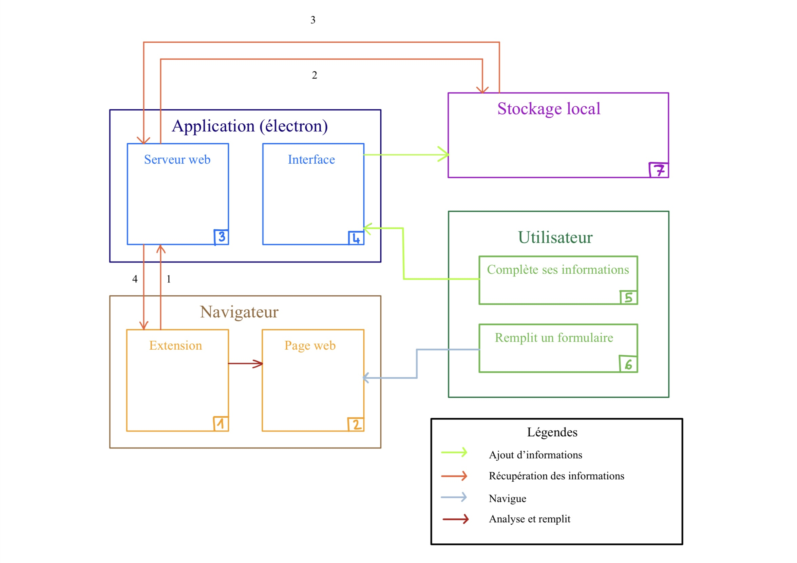

=== Description des interfaces (PAN1 / PAN2)

// Pour le PAN1, il faut identifier et décrire sommairement toutes les
// interfaces entre modules.

// Pour le PAN2, il faut une description complète des interfaces.

// Il faut ici une description textuelle de chaque interface, c'est-à-dire chaque
// échange entre deux blocs.
// Si c’est une interface entre deux blocs informatiques, c’est une interface
// Java.
// S’il y a des échanges de données complexes, il faut en décrire le format avec
// précision.
// Si c’est une interface entre deux blocs électroniques, c’est une description
// des signaux électroniques ou protocoles utilisés.

Rappel du schema

==== Interface Blocs 1-3

L'interface sera comme une API REST, l'extension pourra demander des données aux formats textes ou directement des fichiers.

==== Interface Blocs 3-7

Cette interface sera réalisé par le serveur web qui sera en NodeJS. Cette interface sera uniquement des lectures et écritures du fichiers. Les flèches oranges (et leur numérotation) expliquent les interactions entre les blocs.
