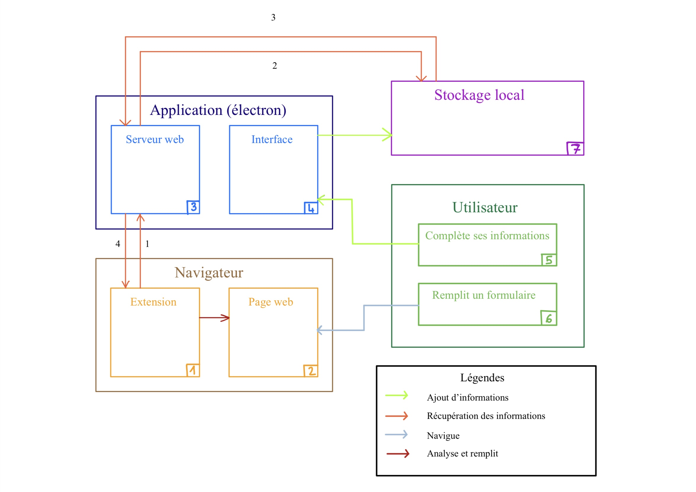

=== Schéma d’architecture

// Insérer ici un ou plusieurs schémas d’architecture du projet. Voir le
// cours d’introduction au Génie Logiciel. N’hésitez pas à faire des
// schémas hiérarchiques, c'est-à-dire avec un bloc d’un schéma général
// raffiné dans un second schéma ; ou des schémas en plusieurs parties.

==== Description des blocs

// Il faut ici une description textuelle de chaque bloc, sa fonction
// détaillée. En général, un bloc correspond à un module, sauf exception.
// Il peut être adapté de faire des blocs plus petits qu’un module.

// Il est important ici de distinguer les bibliothèques identifiées et
// disponibles de ce que vous allez produire (coder) vous-même. Vous ne
// devez pas réinventer la roue, mais vous ne devez pas non plus avoir votre
// projet tout fait en encapsulant un programme déjà existant.

===== Utilisateur

L'utilisateur aura deux comportement possible  :

* Remplir ces informations dans notre application (voir bloc *Application "électron"*) via l'interface graphique de l'application

* Se balader sur un site web pour remplir un formulaire

---

===== Application (électron)

Ce bloc est le centre de notre projet. Il sera lui même séparé en deux parties : 

* Le serveur web (voir bloc *Serveur Web*)

* L'interface de l'application

En savoir plus sur électron : <<Electron>>

====== Serveur Web

Il s'agit d'un serveur web qui expose une API. Cette interface pourra lire, écrire, et modifier le fichier chiffré.

====== Interface de l'application électron

L'interface sera codé en React Native. Voir le schema de l'interface pour plus de détails.

---

===== Navigateur

Le bloc Navigateur représente deux sous bloc :

* la navigation sur une page web faite par l'utilisateur

* l'extension web qui sera sur le navigateur

====== Page web

Le bloc Page web représente une page web sur lequel l'utilisateur se balade et rencontre un forumlaire.

====== Extension

L'extension sera présente sur le navigateur web. Elle analysera les pages web et si elle détecte un formulaire, elle préviendra l'utilisateur pour faire un remplissage. SI l'utilisateur accepte, l'extension enverra des requetes a notre serveur web pour récupérer des données.

---

===== Stockage local

Le bloc de stokage local représente seulement le systeme de fichier de l'odinateur. Notre application stockera les informations dans un "gros" fichier chiffré. Ce fichier sera sur l'ordinateur de l'utilisateur

---

===== Explication général

* Flèches vertes : ces flèches montrent le remplissage des informations par l'utilisateur via l'interface graphique.

* Flèches oranges : Ces flèches montrent comment l'extension web récupère les informations, elle fera des requetes au serveur web et le serveur web ira déchiffrer le fichier puis renvoyer les données.

