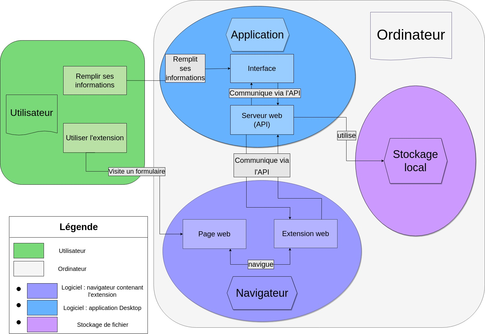

= Rapport module Client/Serveur

Equipe :

* Victor Darré
* Mohammed Khair
* Titouan Mendiharat

== Objectif du module

Le but de ce module est dans une premier temps d'établir puis de sécuriser la connexion entre le serveur et le client.
Nous commencerons par créer un serveur puis nous ferons en sorte qu'il soit capable de communiquer avec l'application qui contient les données des usagers.

== Schéma d'architecture

Voici notre diagramme d'architecture retravaillé : 

== Protocole

A propos du protocole de communication entre le client et le serveur, nous avons avons choisi Node.JS car cela est plus adapté au travail fourni par les autres modules.

== Serveur

Dans le but de commencer à nous familiariser avec les serveurs, nous avons essayé d'en héberger sur une machine, grâce à WampServer qui contient notamment le logiciel apache qui permet de créer un serveur en local.
Par la suite, nous avons codé ce serveur en  PHP pour gérer la communication avec le client.
Cependant, nous souhaitons changer vers un protocole Node.JS afin de nous affranchir du logiciel apache.