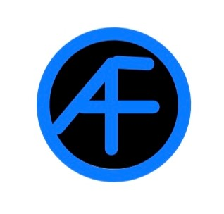

=== Description de la proposition
// *_Note: 2 page max._*

// _Décrire de façon détaillée votre projet : motivations de base/problèmes
// constatés avant élaboration du projet, comment votre projet répond à ces
// besoins. Ajouter une image ou une figure pour montrer à quoi cela
// ressemble si besoin._

Notre projet s'appuie sur un constat que nous avons fait : les démarches administratives sont très souvent voire tout le temps en ligne. Chaque membre de notre groupe a en pu faire l'expérience lors de notre entrée à Télécom ! Tout d'abord avec les démarches de Télécom, mais également pour nos logements respectifs !

Nous faisons beaucoup de démarches en ligne, et cela est parfois long et difficile. Nous voulons donc créer un outil qui puisse aider un maximum de personnes lors de démarches par internet.

Pour résoudre ce problème, nous avons tout d'abord pensé à une extension qui s'occuperait de tout faire en remplissant le formulaire, mais après quelques recherches, il pourrait y avoir certains problèmes au niveau des accès au fichier chiffré par l'extension.

Pour résoudre ce problème, nous avons donc complété l'idée de notre extension par un "logiciel" qui sera créé avec le framework électron. Cela devrait rendre notre projet plus faisable.

Comme vous l'avez compris, un fichier chiffré sera utilisé et sera sur l'ordinateur de l'utilisateur (ainsi, il n'y a pas de problème de RGPD). Ce fichier sera accessible par l'extension en passant par l'application électron. 
Il sera édité par cette application. Par ce biais, l'utilisateur pourra remplir ses données via l'application avec une interface.

L'extension sera intelligente: elle détectera les champs à remplir, puis elle demandera à l'application électron les informations. L'extension pourra donc remplir les champs du formulaire et faciliter la tâche à son utilisateur.

Enfin, notre extension sera capable de signaler à l'utilisateur s'il y a une erreur (par exemple, un champ qui ne peut pas être rempli par manque d'information ou par conflit).

Notre application s'appellera AutoForm et voici son logo :

// === Exemples d'utilisation d'AsciiDoc

// _Ici quelques exemples de syntaxe AsciiDoc pour ajouter des équations, des images, des listes..._

// _Ces exemples *ne doivent pas* être conservés dans la version finale du rapport._

// ==== Exemples d'équations

// * Inline math: latexmath:[\int_{-\infty}^\infty g(x) dx]
// Pour ajouter une équation ou un symbole mathématique dans le corps du texte.

// * Block math pour avoir une équation centrée au milieu de la page:

// [latexmath]
// ++++
// \int_{-\infty}^\infty g(x) dx
// ++++

// ==== Exemples d'images

// * Ceci est un exemple d'image:

// image::../images/logo_PACT.png[logo pact]

// * L'image peut être redimensionnée et avoir un titre:

// .Le logo du projet
// image::../images/logo_PACT.png[logo pact, 400, 400]

// * Pour le rapport, les images peuvent être aux formats jpeg, png ou même *svg*:

// image::../images/pact.svg[un autre logo pact,300,300]

// * Les images peuvent aussi être mises dans le corps du texte par exemple image:../images/logo_PACT.png[logo pact, 50,50].

// ==== Exemples de code

// On peut ajouter des blocs de code formatés en précisant le langage utilisé:

// [source,python]
// ----
// def func(i):
//    x = 3 + i
//    return x

// for i in range(10):
//    print "---> ", func(i)
// ----

// [source,java]
// ----
// class foo {
//    Integer i;
//    String s;
// }
// ----

// ==== Exemples de listes

// * AAAA
// ** aaaaa
// *** axaxax
// ** bbbbb
// ** ccccc
// * BBBB
// * CCCC

// '''''

// .  AAAA
// ..  aaaa
// ..  bbbb
// .  BBBB
// .  CCCC

// '''''

// .Liste des tâches à faire:
// *  [ ] Pas encore fait
// ** [ ] étape X
// ** [x] étape Y (a démarré en avance)
// ** [ ] étape Z
// *  [x] Complètement finit
// ** [x] étape Q
// ** [x] étape R
// ** [x] étape `finale` E=mc^2^

// '''''

// .Liste descriptive:

// Étape 1::: Faire A, B, C…
// Étape 2::: Faire X, Y, Z…
// Étape 3::: Faire W, et c'est fini…

